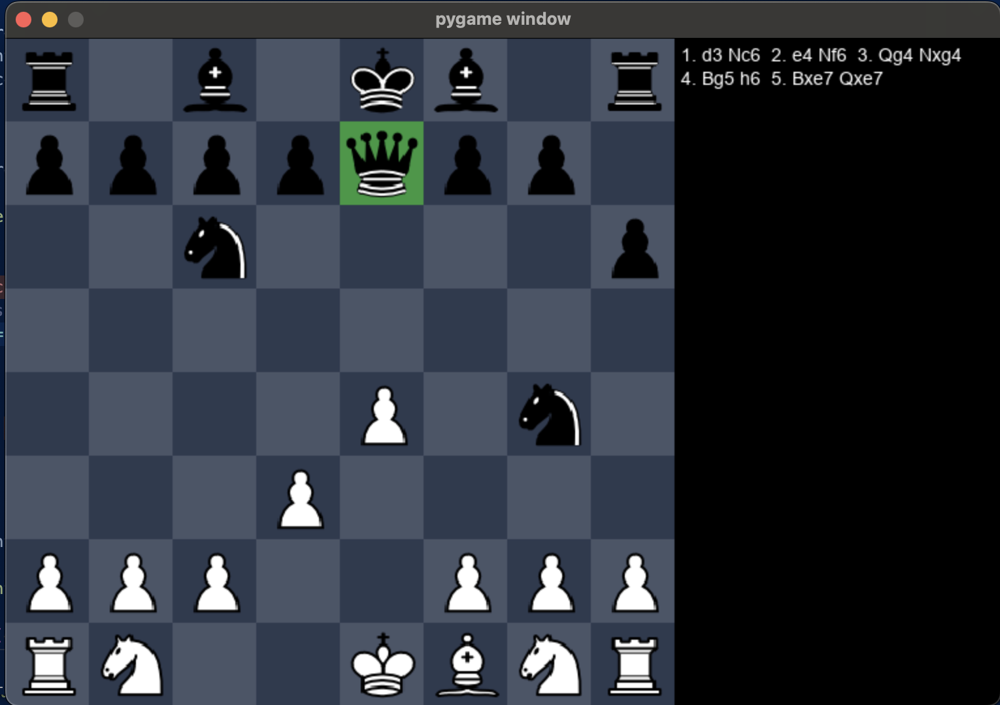
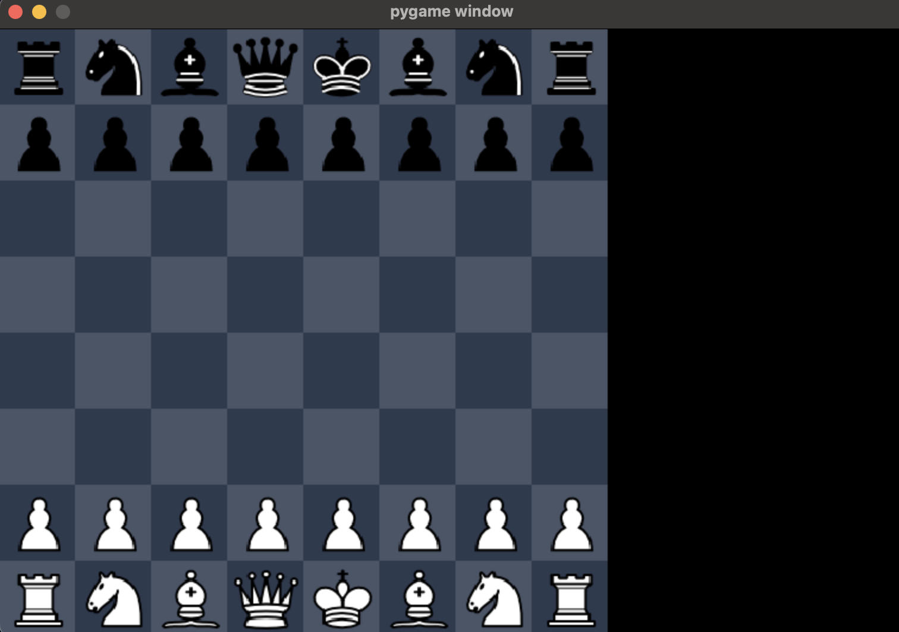

# ChessAI

## Table of Contents
- [Description](#description)
- [Features](#features)
- [Installation](#installation)
- [Usage](#usage)
- [Contributing](#contributing)
- [License](#license)
- [Author](#author)
- [Technologies Used](#technologies-used)

## Description
ChessAI is a chess game that features a unique board design while maintaining the traditional rules and functionalities of chess. Players can compete against an AI opponent, and the moves played are displayed on the side for easy tracking.

## Features
- Play against an AI opponent
- Unique and funky board design
- Move history display

## Screenshots

Here are some screenshots of the ChessAI game:





## Installation
To set up the project locally:

1. Clone the GitHub repository:
   ```sh
   git clone [github.com](https://github.com/varungupta04/ChessAI.git)

   ## Navigate
To explore the project, you can navigate through the following main files and directories:
- `Chess_main.py`: The main script to run the game.
- `assets/`: Contains all the graphical assets and resources used in the game.
- `docs/`: Documentation and additional resources.


## Contributing

You are welcomed to contributions to enhance ChessAI! You can help by addressing the following areas:

1. Implement online multiplayer functionality.
2. Improve the overall code structure, in case you see some 
3. Replace 2D lists with NumPy arrays for better performance and efficiency.
4. Implement rules for stalemates due to threefold repetition or 50-move rule without a capture or pawn movement.
5. Add a menu to select between player vs player and player vs computer modes.
6. Enable piece dragging for more intuitive gameplay.
7. Resolve ambiguities in move notation to ensure clarity.


Please fork the repository, create a new branch, and submit a pull request with your contributions.

## License


#### Sic:
* Press `z` to undo a move.
* Press `r` to reset the game.

  
## Author

[Varungupta04](https://github.com/varungupta04)

## Technologies Used

- Python
- Pygame
